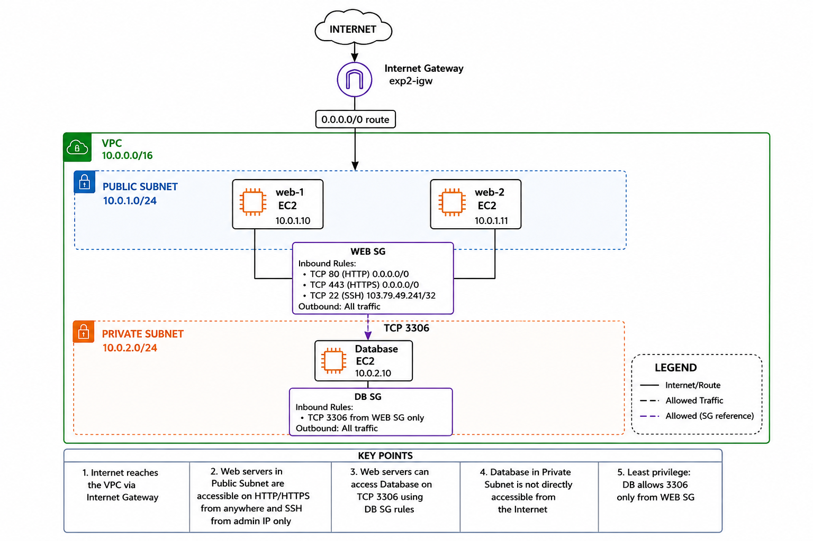
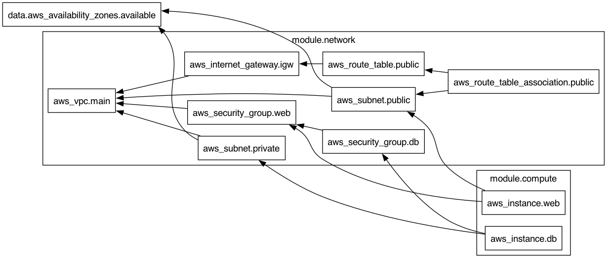

# Experiment 2: Modular AWS Infrastructure using Terraform

## 1. Aim

To design and provision a **multi-tier AWS infrastructure using Terraform modules** consisting of a VPC, public subnet, private subnet, Internet Gateway, routing, security groups, web servers, and a database server.

The experiment also demonstrates how Terraform automatically manages resource dependencies and how those dependencies can be visualized using **Terraform Graph and Graphviz**.

---

## 2. Objectives

The objectives of this experiment are:

- Understand Terraform modules.
- Create separate network and compute modules.
- Create a custom AWS VPC.
- Create public and private subnets.
- Configure an Internet Gateway.
- Configure routing for the public subnet.
- Create security groups.
- Deploy multiple web EC2 instances.
- Deploy a database EC2 instance inside a private subnet.
- Allow database traffic only from the web security group.
- Use Terraform variables and outputs.
- Understand dependencies between Terraform resources.
- Generate a Terraform dependency graph.
- Convert the dependency graph into an image using Graphviz.
- Manage the complete infrastructure using Terraform commands.

---

# 3. Architecture

The infrastructure created in this experiment follows a basic two-tier architecture.



The architecture contains:

```text
Internet
   |
Internet Gateway
   |
Public Route
0.0.0.0/0
   |
   v
+------------------------------------------------+
|                VPC 10.0.0.0/16                |
|                                                |
|   +----------------------------------------+   |
|   |       Public Subnet 10.0.1.0/24       |   |
|   |                                        |   |
|   |     Web-1 EC2          Web-2 EC2       |   |
|   |        |                   |           |   |
|   |        +--------+----------+           |   |
|   |                 |                      |   |
|   |              WEB SG                    |   |
|   +-----------------|----------------------+   |
|                     |                          |
|                  TCP 3306                      |
|                     |                          |
|   +-----------------|----------------------+   |
|   |       Private Subnet 10.0.2.0/24      |   |
|   |                 |                      |   |
|   |            Database EC2                |   |
|   |                 |                      |   |
|   |               DB SG                    |   |
|   +----------------------------------------+   |
|                                                |
+------------------------------------------------+
```

---

# 4. Architecture Components

## VPC

A custom Virtual Private Cloud is created with the CIDR range:

```text
10.0.0.0/16
```

The VPC provides an isolated network for the infrastructure.

---

## Public Subnet

The public subnet uses:

```text
10.0.1.0/24
```

The web EC2 instances are deployed in this subnet.

The public subnet has a route to the Internet Gateway, allowing the web servers to communicate with the Internet.

---

## Private Subnet

The private subnet uses:

```text
10.0.2.0/24
```

The database EC2 instance is deployed in this subnet.

The database is separated from direct Internet access.

---

## Internet Gateway

An Internet Gateway is attached to the VPC.

It provides Internet connectivity for resources that use the public route table.

---

## Public Route Table

The public route table contains a route similar to:

```text
Destination: 0.0.0.0/0
Target: Internet Gateway
```

The route table is associated with the public subnet.

---

# 5. Security Groups

Two security groups are used:

```text
WEB Security Group
DB Security Group
```

## Web Security Group

The Web Security Group is associated with the web EC2 instances.

Inbound access includes:

| Protocol | Port | Source | Purpose |
|---|---:|---|---|
| TCP | 80 | `0.0.0.0/0` | HTTP |
| TCP | 443 | `0.0.0.0/0` | HTTPS |
| TCP | 22 | Admin IP `/32` | SSH |

Outbound traffic is allowed as configured in the Terraform configuration.

Restricting SSH to the administrator's IP is safer than allowing SSH from the entire Internet.

---

## Database Security Group

The database security group protects the database EC2 instance.

The database accepts:

```text
TCP Port: 3306
Source: Web Security Group
```

This means the database does not allow port `3306` from the entire Internet.

Only resources associated with the Web Security Group can access the database on the configured database port.

This demonstrates the **principle of least privilege**.

---

# 6. Traffic Flow

The expected traffic flow is:

```text
Internet
   |
   | HTTP / HTTPS
   v
Internet Gateway
   |
   v
Public Subnet
   |
   +----> Web EC2 Instance 1
   |
   +----> Web EC2 Instance 2
              |
              | TCP 3306
              v
        Database EC2
        Private Subnet
```

The important point is:

```text
Internet -> Web Servers -> Database
```

and not:

```text
Internet ----------------> Database
```

The database is therefore isolated from direct public access.

---

# 7. Project Structure

The Terraform project is organized as:

```text
terraform-exp2/
├── .gitignore
├── .terraform.lock.hcl
├── dependency-graph.dot
├── dependency-graph.png
├── topology.png
├── main.tf
├── modules/
│   ├── compute/
│   │   ├── main.tf
│   │   ├── outputs.tf
│   │   └── variables.tf
│   └── network/
│       ├── main.tf
│       ├── outputs.tf
│       └── variables.tf
├── outputs.tf
├── terraform.tfvars.example
├── variables.tf
├── versions.tf
└── README.md
```

---

# 8. Terraform Module Structure

Instead of defining every resource inside one Terraform file, the infrastructure is separated into modules.

Two modules are used:

```text
modules/network
modules/compute
```

This improves organization and makes the infrastructure easier to understand and reuse.

---

# 9. Network Module

The network module is located at:

```text
modules/network/
```

Structure:

```text
network/
├── main.tf
├── outputs.tf
└── variables.tf
```

The network module is responsible for networking resources such as:

- VPC
- Public subnet
- Private subnet
- Internet Gateway
- Public route table
- Route table association
- Web Security Group
- Database Security Group

---

## Network `main.tf`

The network module's `main.tf` contains the actual AWS network resources.

The main resources include:

```text
aws_vpc
aws_subnet
aws_internet_gateway
aws_route_table
aws_route_table_association
aws_security_group
```

---

## Network `variables.tf`

The file contains input values required by the network module.

Examples include:

```text
VPC CIDR
Public subnet CIDR
Private subnet CIDR
Availability Zone
Administrator IP
```

Variables make the module reusable without changing the resource definitions directly.

---

## Network `outputs.tf`

The network module outputs information required by other modules.

For example:

```text
VPC ID
Public Subnet ID
Private Subnet ID
Web Security Group ID
Database Security Group ID
```

These outputs can then be passed to the compute module.

---

# 10. Compute Module

The compute module is located at:

```text
modules/compute/
```

Structure:

```text
compute/
├── main.tf
├── outputs.tf
└── variables.tf
```

The compute module manages EC2 resources.

It creates:

- Web EC2 instances
- Database EC2 instance

---

## Compute `main.tf`

The compute module contains resources similar to:

```text
aws_instance.web
aws_instance.db
```

The web instances use:

```text
Public Subnet
Web Security Group
```

The database instance uses:

```text
Private Subnet
Database Security Group
```

---

## Compute `variables.tf`

The compute module receives information from the root module.

Examples:

```text
AMI ID
Instance type
Public subnet ID
Private subnet ID
Web security group ID
Database security group ID
```

---

## Compute `outputs.tf`

The compute module can return useful information such as:

```text
Web instance IDs
Web public IP addresses
Database instance ID
Database private IP address
```

These values can then be displayed by the root module.

---

# 11. Root Module

The root of the project contains:

```text
main.tf
variables.tf
outputs.tf
versions.tf
```

The root module connects the network and compute modules.

The general dependency is:

```text
Root Module
    |
    +------> Network Module
    |             |
    |             | Outputs
    |             v
    +------> Compute Module
```

The network module creates the networking infrastructure first.

Its outputs are passed to the compute module so that EC2 instances can be placed in the correct subnets and security groups.

---

# 12. Terraform Versions

The `versions.tf` file defines Terraform and provider requirements.

Example:

```hcl
terraform {
  required_version = ">= 1.0"

  required_providers {
    aws = {
      source  = "hashicorp/aws"
      version = "~> 5.0"
    }
  }
}
```

This ensures that the project uses compatible Terraform and AWS provider versions.

---

# 13. Terraform Variables

The root `variables.tf` defines values required by the configuration.

Examples can include:

```text
AWS region
VPC CIDR
Public subnet CIDR
Private subnet CIDR
AMI ID
Instance type
Administrator IP
```

Using variables avoids hardcoding configuration values throughout the Terraform files.

---

# 14. Terraform Variable File

An example variable file is provided:

```text
terraform.tfvars.example
```

Create the real variable file using:

```bash
cp terraform.tfvars.example terraform.tfvars
```

Then edit:

```text
terraform.tfvars
```

and provide the required values.

Example structure:

```hcl
aws_region          = "us-east-1"
vpc_cidr            = "10.0.0.0/16"
public_subnet_cidr  = "10.0.1.0/24"
private_subnet_cidr = "10.0.2.0/24"

# Other values according to the project configuration
```

The exact variable names should match the project's `variables.tf`.

The real `terraform.tfvars` file should not be committed if it contains sensitive or environment-specific information.

---

# 15. Prerequisites

The following tools are required:

- Terraform
- AWS CLI
- AWS account
- Git
- Graphviz
- Terminal
- Code editor

Check Terraform:

```bash
terraform --version
```

Check AWS CLI:

```bash
aws --version
```

Check Graphviz:

```bash
dot -V
```

---

# 16. Install Graphviz on macOS

Graphviz can be installed using Homebrew:

```bash
brew install graphviz
```

Verify:

```bash
dot -V
```

Graphviz is used later to convert the Terraform dependency graph into a PNG image.

---

# 17. Configure AWS Credentials

Configure AWS CLI:

```bash
aws configure
```

Provide:

```text
AWS Access Key ID
AWS Secret Access Key
Default AWS Region
Default Output Format
```

Verify authentication:

```bash
aws sts get-caller-identity
```

Do not store AWS secret keys inside Terraform files or GitHub repositories.

---

# 18. Step 1 — Enter the Project Directory

Navigate to the experiment:

```bash
cd terraform-exp2
```

Check the project:

```bash
tree -L 3
```

---

# 19. Step 2 — Initialize Terraform

Run:

```bash
terraform init
```

Terraform initializes:

- Root module
- Network module
- Compute module
- AWS provider

It also downloads the required provider plugins.

Expected output includes:

```text
Terraform has been successfully initialized!
```

---

# 20. Step 3 — Format the Configuration

Because the project contains multiple modules, format everything recursively:

```bash
terraform fmt -recursive
```

---

# 21. Step 4 — Validate the Configuration

Run:

```bash
terraform validate
```

Expected result:

```text
Success! The configuration is valid.
```

If errors are reported, fix the Terraform configuration before continuing.

---

# 22. Step 5 — Create `terraform.tfvars`

Copy the example file:

```bash
cp terraform.tfvars.example terraform.tfvars
```

Edit the file:

```bash
nano terraform.tfvars
```

or open it using your preferred editor.

Set the required values according to the variables defined in the project.

---

# 23. Step 6 — Review the Terraform Plan

Run:

```bash
terraform plan
```

Terraform reads the configuration and calculates which resources need to be created.

The plan should include resources from both:

```text
module.network
module.compute
```

Review the plan before applying it.

---

# 24. Step 7 — Save the Terraform Plan

The plan can optionally be saved:

```bash
terraform plan -out=tfplan
```

This creates:

```text
tfplan
```

The saved plan can later be applied using:

```bash
terraform apply tfplan
```

`tfplan` is a generated file and should not normally be committed to Git.

---

# 25. Step 8 — Apply the Infrastructure

If a saved plan was created:

```bash
terraform apply tfplan
```

Otherwise:

```bash
terraform apply
```

When prompted, enter:

```text
yes
```

Terraform creates the infrastructure in the required dependency order.

---

# 26. Resources Created

The infrastructure includes resources such as:

```text
VPC
|
+-- Internet Gateway
|
+-- Public Subnet
|     |
|     +-- Route Table Association
|     |
|     +-- Web EC2 Instance(s)
|
+-- Private Subnet
|     |
|     +-- Database EC2 Instance
|
+-- Web Security Group
|
+-- Database Security Group
```

---

# 27. Step 9 — View Terraform Outputs

After a successful apply:

```bash
terraform output
```

Outputs can include useful information about the created infrastructure.

For example:

```text
Web instance IP addresses
Database private IP
VPC ID
Subnet IDs
```

The actual output depends on the values defined in `outputs.tf`.

---

# 28. Step 10 — View Terraform State

List all resources managed by Terraform:

```bash
terraform state list
```

The output should contain resources from the modules.

For example:

```text
module.network.aws_vpc.main
module.network.aws_subnet.public
module.network.aws_subnet.private
module.network.aws_internet_gateway.igw
module.network.aws_route_table.public
module.network.aws_route_table_association.public
module.network.aws_security_group.web
module.network.aws_security_group.db
module.compute.aws_instance.web
module.compute.aws_instance.db
```

Exact names depend on the Terraform configuration.

View detailed state information:

```bash
terraform show
```

---

# 29. Step 11 — Verify Infrastructure in AWS

Open the AWS Management Console.

Verify the VPC:

```text
AWS Console
→ VPC
→ Your VPCs
```

Verify subnets:

```text
AWS Console
→ VPC
→ Subnets
```

Verify the Internet Gateway:

```text
AWS Console
→ VPC
→ Internet Gateways
```

Verify route tables:

```text
AWS Console
→ VPC
→ Route Tables
```

Verify security groups:

```text
AWS Console
→ EC2
→ Security Groups
```

Verify EC2 instances:

```text
AWS Console
→ EC2
→ Instances
```

The web instances should be associated with the public subnet and Web Security Group.

The database instance should be associated with the private subnet and Database Security Group.

---

# 30. Step 12 — Generate the Terraform Dependency Graph

Terraform can generate a graph showing relationships between resources.

Run:

```bash
terraform graph
```

The output is generated in the DOT graph description format.

Save it to a file:

```bash
terraform graph > dependency-graph.dot
```

This creates:

```text
dependency-graph.dot
```

---

# 31. Step 13 — Convert the Graph to PNG

Use Graphviz:

```bash
dot -Tpng dependency-graph.dot -o dependency-graph.png
```

This creates:

```text
dependency-graph.png
```

The generated dependency graph for this experiment is shown below.



---

# 32. Understanding the Dependency Graph

The dependency graph shows how Terraform resources depend on each other.

For example:

```text
VPC
 |
 +----> Public Subnet
 |
 +----> Private Subnet
 |
 +----> Internet Gateway
 |
 +----> Security Groups
```

The public route table depends on networking resources such as the VPC and Internet Gateway.

The EC2 web instances depend on resources from the network module, including:

```text
Public Subnet
Web Security Group
```

The database instance depends on:

```text
Private Subnet
Database Security Group
```

Terraform determines these dependencies automatically from references between resources and modules.

---

# 33. Module Dependency

At a high level:

```text
                 +----------------+
                 | Network Module |
                 +-------+--------+
                         |
                         | subnet IDs
                         | security group IDs
                         v
                 +----------------+
                 | Compute Module |
                 +----------------+
```

The compute module requires networking resources before it can create the EC2 instances.

Terraform automatically handles the correct creation order.

---

# 34. Security Design

The infrastructure follows a simple layered security model.

### Internet-facing layer

The web servers are placed in:

```text
Public Subnet
```

They can receive web traffic according to the Web Security Group rules.

### Internal layer

The database is placed in:

```text
Private Subnet
```

It does not need to accept direct traffic from the Internet.

### Database access

The database allows:

```text
TCP 3306
```

from:

```text
Web Security Group
```

instead of:

```text
0.0.0.0/0
```

This reduces unnecessary exposure of the database.

---

# 35. Why Use Modules?

Without modules, all resources could be placed inside one large `main.tf`.

For example:

```text
main.tf
├── VPC
├── Subnets
├── Routes
├── Security Groups
├── Web Instances
└── Database Instance
```

This becomes difficult to maintain as infrastructure grows.

Using modules gives:

```text
modules/
├── network/
└── compute/
```

Benefits include:

- Better organization
- Easier maintenance
- Reusable configurations
- Clear separation of responsibilities
- Easier debugging

---

# 36. Terraform State

Terraform stores information about managed resources in:

```text
terraform.tfstate
```

A backup may also exist:

```text
terraform.tfstate.backup
```

These files should not normally be committed to Git.

Useful state commands:

```bash
terraform state list
```

```bash
terraform show
```

---

# 37. Step 14 — Destroy the Infrastructure

After completing the experiment, destroy the AWS resources to prevent unnecessary charges.

Preview:

```bash
terraform plan -destroy
```

Destroy:

```bash
terraform destroy
```

Enter:

```text
yes
```

Terraform removes the managed resources in the required dependency order.

After completion:

```text
Destroy complete!
```

---

# 38. Complete Experiment Workflow

The overall workflow is:

```text
Create Terraform Files
          |
          v
Create Network Module
          |
          v
Create Compute Module
          |
          v
Connect Modules
          |
          v
Create terraform.tfvars
          |
          v
   terraform init
          |
          v
terraform fmt -recursive
          |
          v
 terraform validate
          |
          v
   terraform plan
          |
          v
  terraform apply
          |
          v
    AWS Resources
          |
          v
 terraform output
          |
          v
terraform state list
          |
          v
   terraform graph
          |
          v
      Graphviz
          |
          v
dependency-graph.png
          |
          v
 terraform destroy
```

---

# 39. Important Commands Used

| Command | Purpose |
|---|---|
| `terraform init` | Initializes Terraform and downloads providers/modules |
| `terraform fmt -recursive` | Formats Terraform files and module files |
| `terraform validate` | Validates Terraform configuration |
| `terraform plan` | Previews infrastructure changes |
| `terraform plan -out=tfplan` | Saves the execution plan |
| `terraform apply` | Creates or modifies infrastructure |
| `terraform apply tfplan` | Applies a saved plan |
| `terraform output` | Displays output values |
| `terraform state list` | Lists resources managed by Terraform |
| `terraform show` | Displays Terraform state information |
| `terraform graph` | Generates the dependency graph |
| `terraform destroy` | Removes managed infrastructure |
| `dot -Tpng ...` | Converts DOT graph to PNG using Graphviz |

---

# 40. Git Ignore Configuration

Terraform creates local and generated files that should not be committed.

Example `.gitignore`:

```gitignore
# Terraform working directory
**/.terraform/*

# Terraform state
*.tfstate
*.tfstate.*

# Terraform plan files
tfplan
*.tfplan

# Variable files
*.tfvars
*.tfvars.json

# Keep example variable files
!*.tfvars.example

# Crash logs
crash.log
crash.*.log

# macOS
.DS_Store
```

The following file should generally remain committed:

```text
.terraform.lock.hcl
```

It records the provider versions selected by Terraform.

---

# 41. Files That Should and Should Not Be Committed

### Commit

```text
main.tf
variables.tf
outputs.tf
versions.tf
terraform.tfvars.example
.terraform.lock.hcl
modules/
dependency-graph.dot
dependency-graph.png
topology.png
README.md
```

### Do Not Commit

```text
.terraform/
terraform.tfstate
terraform.tfstate.backup
terraform.tfvars
tfplan
.DS_Store
```

---

# 42. Troubleshooting

## Terraform command not found

Check:

```bash
terraform --version
```

If Terraform is not installed on macOS, install it before continuing.

---

## AWS authentication error

Verify AWS credentials:

```bash
aws sts get-caller-identity
```

If authentication fails, configure AWS again:

```bash
aws configure
```

---

## Invalid Terraform configuration

Run:

```bash
terraform fmt -recursive
terraform validate
```

Fix any errors displayed by Terraform.

---

## Graphviz command not found

Check:

```bash
dot -V
```

Install Graphviz on macOS:

```bash
brew install graphviz
```

---

## Terraform dependency graph not generated

First ensure Terraform has been initialized:

```bash
terraform init
```

Then:

```bash
terraform graph > dependency-graph.dot
```

Convert it:

```bash
dot -Tpng dependency-graph.dot -o dependency-graph.png
```

---

# 43. Result

Successfully designed and provisioned a **modular multi-tier AWS infrastructure using Terraform**.

The experiment created networking and compute infrastructure using separate Terraform modules.

The infrastructure included:

- Custom VPC
- Public subnet
- Private subnet
- Internet Gateway
- Public routing
- Web Security Group
- Database Security Group
- Web EC2 instances
- Database EC2 instance
- Module inputs and outputs
- Terraform resource dependencies
- Terraform dependency graph

The Terraform dependency graph was successfully generated and visualized using Graphviz.

---

# 44. Key Learnings

Through this experiment, we learned:

- How Terraform modules are created and used.
- How networking and compute resources can be separated into different modules.
- How to create a VPC using Terraform.
- How public and private subnets are used.
- How an Internet Gateway provides Internet connectivity.
- How route tables control network routing.
- How security groups control access to EC2 instances.
- How security groups can reference other security groups.
- How to keep a database isolated from direct Internet access.
- How module outputs can be passed as inputs to another module.
- How Terraform automatically determines resource dependencies.
- How `terraform graph` visualizes Terraform dependencies.
- How Graphviz converts Terraform graphs into PNG images.
- How Terraform state tracks cloud infrastructure.
- How to safely destroy resources after completing an experiment.
- Which Terraform-generated files should not be committed to Git.